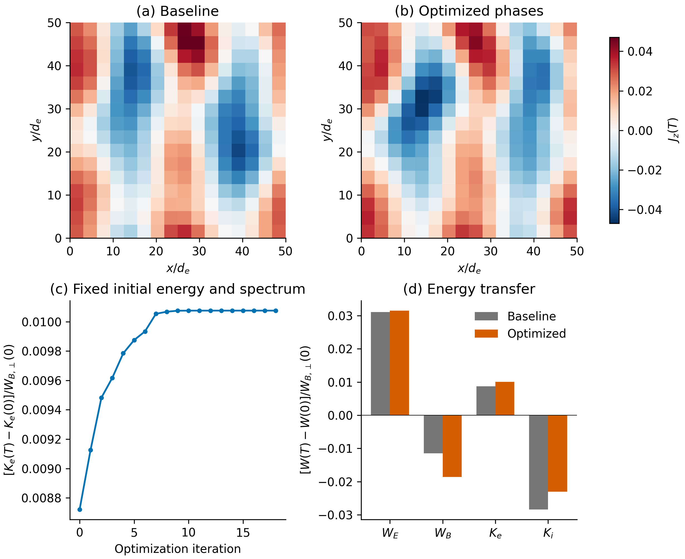
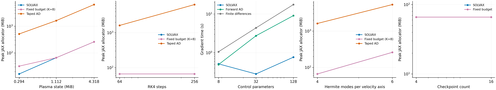

# Differentiable plasma control in SPECTRAX

SPECTRAX can expose useful gradients without introducing a separate plasma adjoint implementation. The recommended first showcase is **phase-only control of time-averaged electron energization in a two-species, 2D3V Orszag–Tang-type plasma**, with identical initial magnetic spectra and initial energies. It combines a constrained, interpretable inverse-design problem with a demanding velocity-space discretization, while keeping the numerical addition small.

The implementation adds `simulation_final`, a terminal-state API using the existing Vlasov–Maxwell RHS and classical fixed-step RK4. The default uses SOLVAX's checkpointed recurrence, with JVP and VJP support. An optional fixed checkpoint count selects Diffrax's binomial reverse scheduler for the same RK4 scheme. A small uncheckpointed path provides a reference. Neither changes the collision operator, Fourier transforms, Maxwell equations, or Hermite coupling.

This is an exact discrete-gradient implementation up to floating-point error. It is not an implementation of the local block-sweep adjoint of Shu et al., and it does not claim resolution-independent memory or a globally optimal optimizer. The distinction is essential to a defensible publication.

## Repository and example context

The implementation starts from SPECTRAX `main` at `2afb1f621378d990940feed5222accf377279c07`. The existing open PR #36 exposes Diffrax adjoint selection and a small 1D inverse problem. The new terminal solve complements that work rather than changing its branch. Multiple open midpoint and SOLVAX PRs are relevant to future implicit integration but are not prerequisites for this example.[^1]

The supplied `2D_Orszag_Tang.py` and TOML use DG/Legendre coefficients, `Omega_ce`, species masses, and `N_DG`. Current main uses a real Fourier transform in x, Fourier transforms in y/z, `Omega_cs`, and `mi_me`. The new example therefore reconstructs the same type of electron-ion vortex using main's coefficient layout. It preserves the supplied domain lengths, mass ratio, thermal scales, guide field, and perturbation scale, with smaller numerical defaults for reproducibility. The supplied 128² × 6³ × two-species, long-time case remains a target for accelerator runs, not a completed local benchmark.

## Method selection

Let the stored plasma state have size S, the number of time steps be N, the number of controls be P, and the number of inner nonlinear iterations be M. These are different scaling axes. A full reverse tape can grow with S, N, and M simultaneously. Returning a full trajectory also costs O(NS), even if its adjoint is otherwise memory efficient.

| Method | Differentiated object | Retained state/workspace | Decision for this PR |
|---|---|---|---|
| Ordinary reverse AD through fixed RK4 | Executed discrete steps | O(NS), with substantial stage/RHS factors | Small reference only |
| SOLVAX segmented replay | Same discrete RK4 map | O(S(ceil(N/C)+C)) plus one-step workspace | Default; supports JVP and VJP |
| Fixed-budget binomial replay | Same discrete RK4 map | O(KS) plus one-step workspace | `checkpoints=K`; reverse mode |
| Forward AD | Same discrete RK4 map | One tangent per direction; batched Jacobian grows with P | Verification and small P |
| Continuous backsolve adjoint | Discretized continuous sensitivity equations | Small state footprint, but different gradient | Not selected |
| Implicit differentiation per time step | Converged discrete step equation | No nonlinear-iteration tape; matrix-free Krylov workspace | Appropriate future implicit path |
| Reverse local block sweeps | Executed ordered block-update algorithm | Depends on replay and block locality | Requires a new suitable primal decomposition |
| Localized SOLVAX Hermite/block adjoint | Selected outputs under structural/localization assumptions | Potentially small retained window | No general validity for nonlinear transient plasma |

SOLVAX 0.20.0 already supplies `checkpointed_fori_loop`; no SOLVAX source modification is necessary here. Its segment width C defaults to ceil(sqrt(N)). `jax.checkpoint` around each RK4 step prevents a segment from retaining all the FFT and force-evaluation intermediates of all its stages. Those intermediates are rebuilt locally when needed. This implementation retains full physical states, not dense state Jacobians.[^2][^3]

A two-level schedule is not a hard memory bound in N. For that requirement, `checkpoints=K` uses Diffrax's existing scheduler, with a terminal-only save. Increasing K trades memory for fewer replays. An integer integration clock executes exactly N updates; physical time and time-step factors remain differentiable inside the vector field. The fixed-budget path supports reverse mode; the default SOLVAX path supplies forward mode as well.[^4]

### What “differentiate the solver” means here

Shu et al. study ordered local implicit updates, concretely vertex block descent. Their finite-depth reverse construction must account for the dependence of local systems on the state and for the derivatives of safeguards. The lesson that transfers is to differentiate the actual finite numerical algorithm. Their local-block construction and reported speedups do not transfer automatically to a global spectral Vlasov–Maxwell RHS or an explicit Runge–Kutta integrator. Equation-level implicit differentiation can also be matrix-free; dense assembly is not an inherent requirement.[^5]

SPECTRAX's nonlinear force evaluation uses real-space multiplication and Fourier transforms, while Hermite coupling connects velocity moments. Merely declaring velocity modes to be “blocks” does not produce the paper's primal update structure. An efficient block-implicit split would require a new consistency/stability study and an adjoint of each executed solve. That is a larger numerical-method contribution than the minimal API requested here.

For a nonlinear implicit midpoint step, an eventual SOLVAX integration could differentiate

`R(y_next, y, theta) = y_next - y - dt*f((y+y_next)/2, theta) = 0`.

The reverse action solves the transposed linearized step residual and propagates its dependence on the previous state and parameters. SOLVAX `root_solve` with an explicitly supplied matrix-free tangent solver is relevant. Its default dense tangent solve is inappropriate for this plasma state size. A root derivative is only the intended derivative when the step root is converged; it is not automatically the derivative of a Newton iteration stopped after a fixed budget. Complex Fourier coefficients must also be treated as real-linear unknowns because inverse real FFTs and nonlinear products are not holomorphic. These are reasons to avoid introducing an unverified custom VJP merely to make a dynamic Newton loop traceable.[^2]

Skene and Burns provide a closer spectral-PDE precedent: high-level discrete adjoints composed with efficient transform and structured-solve derivatives. Their work also illustrates why a differentiable spectral solver is not itself a claim of scientific novelty. Here the useful contribution is the combination of a kinetic plasma model, constrained physical optimization, a small API, and controlled memory measurements.[^6]

## Physics design

Start from a periodic 50 × 50 domain, guide field Bz=1, in-plane field amplitude 0.2, electron cyclotron normalization 0.5, and mass ratio 25. Both species have an Orszag–Tang in-plane flow of amplitude 0.02. Electrons carry the initial out-of-plane current; ions have zero out-of-plane drift. Initial electric fields vanish and both densities are uniform and equal.

The control adds distinct oblique magnetic-potential modes. For a wavevector `(i,j)`, write

`A_z^(i,j) = a_(i,j)/|k_(i,j)| * cos(k_(i,j)·x + theta_(i,j))`,

with fixed `a_(i,j)=0.06/sqrt(i²+j²)`. Construct `B_perp=(d_y A_z,-d_x A_z)` and `Jz/Omega_ce=-laplacian(A_z)`. Set the electron z drift to `-Jz` at unit density. Mode amplitudes, the guide field, and the original vortex flow do not change during optimization. Only the phases theta change.

Distinct resolved Fourier modes are orthogonal. Phase changes therefore preserve every added magnetic-mode power and the volume integral of B_perp². They also preserve the current spectrum and the volume integral of the squared electron z drift. Since the thermal scales, uniform density, and in-plane flows are fixed, the integrated initial kinetic energies of both species are fixed as well. The tests verify these energy constraints, the Fourier spectrum, solenoidal magnetic fields, and the initial Ampere relation. Initial electric Gauss consistency follows from E=0 and equal species density.

This prevents the easiest unphysical optimization shortcut: injecting more initial energy. The control is still deliberately broad. Phase changes alter the spatial placement of structures, local stresses, and alignment with the fixed vortex. They do not preserve every higher-order spatial statistic or all cross correlations. Those changes are the physical mechanism available to the optimizer.

The recommended objective averages the electron gain over a smooth time window:

`L(theta) = -integral w(t) [K_e(t;theta)-K_e(0;theta)] / W_B,perp(0;theta) dt`.

For the demonstrated window [40,60], use `z=(2*t-100)/20` and `w(t)=15/(8*20)*(1-z²)²` inside the window, zero outside. This weight integrates to one and has a continuous first derivative at both endpoints. Omitting `--window` retains the simpler terminal-time objective.

It maximizes **time-averaged net electron kinetic-energy gain**, normalized by the initial fluctuating magnetic energy. The guide-field energy is excluded from the denominator. Electric, magnetic, electron, and ion energy changes must be plotted together, because ion flow and electric fields can participate in the transfer. The objective does not establish that all electron energy came from magnetic energy; nor is it an entropy-production or irreversible-heating diagnostic.

Kinetic current sheets and particle energization are physically connected, but their association alone does not identify the dissipation mechanism. TenBarge and Howes studied self-consistent current sheets and collisionless damping in kinetic turbulence; Zhou, Liu, and Loureiro emphasize the role of electron kinetics and Hermite-space transfer. These motivate current and velocity-space diagnostics, rather than equating a strong Jz structure with heating.[^7][^8]

### Alternative objectives

The final-state API does not encode an energy loss. Any differentiable real scalar functional of `(Ck,Fk)` is admissible: electric energy, magnetic energy, species kinetic energy, regional current energy, a smooth weighted shape mismatch, or current intermittency such as `<Jz^4>`. Use correct Parseval weights for real FFTs; the last stored x mode receives weight one only on even grids.

For a current-shape showcase, use a physically specified region or a smooth target and compare initial as well as final current maps. A short-horizon target-matching problem can be solved mostly by arranging the initial structure. Avoid presenting that as nonlinear control unless the final evolution adds a demonstrated benefit. A current-concentration ratio can also be manipulated through its denominator, so report the constituent numerator and denominator separately.

Phase-only electron energization is preferable for the first example because it keeps the initial energy constraints transparent and the outcome scalar. An inverse problem recovering synthetic parameters is excellent for API verification, but is less compelling as a lead physics result. A reconnection-control example could be more application-specific, at the cost of additional equilibrium, boundary-condition, and reconnection-rate validation. Differentiable wavepacket discovery is already established prior art and should not be claimed as a new category of capability.[^9]

## API and reproduction

Install the repository and example dependencies:

```bash
python -m pip install -e .
python -m pip install scipy pytest
```

A scalar loss is an ordinary JAX function:

```python
import jax
import jax.numpy as jnp
from spectrax import simulation_final

def loss(theta):
    parameters = make_initial_conditions(theta)
    Ck, Fk = simulation_final(
        parameters, steps=1000, Nx=64, Ny=64,
        Nn=6, Nm=6, Np=6, checkpoints=16,
    )
    return my_real_scalar_observable(Ck, Fk, parameters)

value, gradient = jax.jit(jax.value_and_grad(loss))(theta)
```

`make_initial_conditions` and `my_real_scalar_observable` are application functions, not new SPECTRAX APIs. Remove `checkpoints=16` to use the SOLVAX path and enable `jax.jvp` as well. `checkpoint_size` tunes the SOLVAX segment width. `checkpointing=False` selects the taped reference for small cases. Static resolutions and step counts should be captured in a closure or marked static in an outer JIT.

The solver returns only one coefficient snapshot, with no leading time dimension and no diagnostic dictionary. It does not retain or return the initial conditions again. A large dense Jacobian is unnecessary for scalar optimization: use `value_and_grad`. For a few outputs and many inputs, use VJPs or reverse mode; for one or two input directions and many outputs, use JVPs. Pass `integrand(t, Ck, Fk)` to accumulate a real scalar or fixed-shape array with the same RK4 stages. The return value becomes `(Ck, Fk, integral)`. This adds only the accumulator to each checkpoint, enabling time-window objectives without a stored trajectory. The callback may capture differentiable parameters from the outer loss. For example:

```python
Ck, Fk, energy_integral = simulation_final(
    parameters, steps=1000, Nx=64, Ny=64, Nn=6, Nm=6, Np=6,
    integrand=lambda t, Ck, Fk: weight(t) * magnetic_energy(Fk),
)
```

Run the small reproducible optimization and refinement:

```bash
python Examples/2D_phase_control.py --grid 16 --hermite 4 --time 60 --window 40 60 \
    --steps 600 --iterations 30 --output phase-control
python benchmarks/validate_phase_control.py phase-control --reoptimize 20
python benchmarks/gradient_scaling.py --output gradient-scaling
```

Test additional phase seeds and evaluate frozen optimized controls on shifted windows:

```bash
python benchmarks/phase_robustness.py --window 40 60 \
    --shifts -10 -5 0 5 10 --seeds 11 23 --iterations 40 \
    --output window-robustness
```

Seed 7 reuses the saved coarse reference controls; the other seeds are optimized on the specified training window. All shifted windows reuse those controls without re-optimization. The script records signed gains, omits ratios for nonpositive baselines and saves each completed optimization/window batch. `--resume` accepts only the same settings, source and environment. A different training window still reuses the original seed-7 reference, so its source window must be distinguished from newly trained controls.

For an NVIDIA GPU, install a CUDA-enabled JAX build appropriate to the machine. The complete isolated-worker scaling matrix is reproducible with:

```bash
STUDY_PYTHON=python bash benchmarks/run_gpu_study.sh results/gpu
```

The script selects one GPU and disables preallocation. It varies spatial resolution, Hermite resolution, rollout length, checkpoint budget and control count separately. The long-rollout comparison excludes the oversized taped reference. Each result directory contains a source/package/device manifest; `--resume` rejects a changed environment, and `--plot-only` renders saved measurements without rerunning them.

These are experiment configurations, not assertions of physical resolution or stability. Fixed-step RK4 has no automatic error estimate. Increase the step count as spatial/Hermite resolution and the fastest physical frequency require. If explicit stability dominates total cost, assess an implicit or IMEX method in a separate measured comparison before changing the default.

## Verification and publication evidence

There are three independent questions: whether the derivative matches the finite algorithm; whether that algorithm approximates the chosen plasma model adequately; and whether the optimized physical outcome survives refinement and reasonable perturbations.

The derivative tests compare SOLVAX segment sizes, including a non-dividing segment length, against a taped reverse reference; compare fixed-budget reverse mode against the same reference; compare JVP/VJP results; and test finite differences through initial coefficients, collisionality, and terminal time. Random complex coefficients exercise both real and imaginary dependencies. A separate test checks RK4 convergence against high-accuracy Dopri8. The 2D example checks all four energy classes and a nonlinear current functional. These checks support first-order discrete gradients; they do not certify higher-order derivatives of every scheduler.

The example records a finite-difference step-size sweep. Agreement should improve as truncation error decreases and eventually worsen as cancellation appears. The refinement script independently increases spatial resolution, Hermite resolution, and time steps at the saved baseline and optimized controls. It records objective values, gradients, energy errors, and a Hermite-tail indicator. A small tail indicator is useful evidence, not a proof of convergence or positivity of a truncated distribution.

The benchmark compares identical equations, initial states, RK4 step counts, and control vectors. Every fresh worker compiles once, warms up, synchronizes, and reports the median of three runs. Finite differences are serial centered differences, requiring 2P primal solves; the forward baseline uses `jacfwd`, which may trade additional memory for batching. No universal factor-P speedup is assumed. Gradient agreement is checked before a comparison is accepted.

Three memory quantities are kept separate: XLA's compiled buffer estimate; whole-process peak resident memory, which includes compilation and host allocations; and a GPU allocator peak when available. JAX's profiling documentation explains why live device buffers and process memory are distinct; a device-memory snapshot alone is not a peak-in-time measurement.[^10] Run timing experiments on an otherwise idle machine and report hardware, precision, package versions, and source hashes. Repeat across GPU sizes only when actual hardware is available.

The publication should show (1) baseline and optimized current maps with one shared color scale; (2) optimization history and all energy-transfer channels; (3) gradient agreement against finite differences; and (4) separate state-size, rollout-length, and control-count scaling. Report the selected checkpoint count in the figure caption. Avoid a memory-axis label that suggests measured GPU peak when the plotted quantity is XLA's static buffer estimate.

A fair advantage claim is that scalar-objective gradients scale substantially better with control count than black-box finite differences, while checkpointing removes trajectory-tape storage growth. Existing differentiable plasma and spectral codes remain relevant comparators. A nondifferentiable code with a hand-written adjoint can also obtain adjoint complexity; differentiation availability and implementation effort are part of the comparison, not a unique law of JAX.

Longer turbulent horizons introduce additional difficulties: sensitivity to initial conditions, finite-time gradient conditioning, unresolved spatial/velocity cascades, and possible overfitting to one time or numerical truncation. A robust final physics claim should include several initial phase seeds, a nearby terminal-time window, and convergence of the optimization benefit. The seed and time-window checks below address some of these issues; they do not establish a long-time turbulent heating result.

## Verified results and source review

The checked-in CPU results use float64/complex128, JAX 0.9.2 and SOLVAX 0.20.0. They are numerical-method and finite-time control demonstrations, not NVIDIA GPU measurements. The optimization at 16² spatial resolution, 4³ Hermite modes per species, T=50 and 500 RK4 steps converged in 18 L-BFGS iterations.

| Resolution | Baseline electron gain / initial fluctuating magnetic energy | Optimized gain | Relative improvement |
|---|---:|---:|---:|
| 16², 4³, 500 steps | 0.00872138 | 0.01007511 | 15.522% |
| 16², 4³, 1000 steps | 0.00871894 | 0.01007263 | 15.526% |
| 24², 4³, 1000 steps | 0.00873132 | 0.01009057 | 15.568% |
| 16², 6³, 1000 steps | 0.00865428 | 0.01000272 | 15.581% |
| 24², 6³, 1000 steps | 0.00866430 | 0.01001854 | 15.630% |

The refined cases re-evaluate the same saved controls; they do not re-optimize them. The best directional finite-difference agreement in the saved sweep is about 2.5e-9 relative. Initial-energy differences between the baseline and optimized controls are zero to the reported floating-point precision. Total-energy error is about 1.2e-9 relative on the optimization discretization and 3.4e-11 after time refinement. These conservation errors are not bounds on the physical-model error.



*Finite-time control at the native 16² plotting resolution. Shared color limits permit a direct current comparison. The energy-transfer panel includes ions and electric fields so that electron energization is not misidentified as exclusively magnetic conversion.*


*The finite-difference sweep concerns one normalized random direction at the initial controls. Independent spatial, velocity and time refinement preserves the benefit, while changing the individual objective values and leaving a nonzero refined gradient at the coarse-grid optimum.*


*Memory panels show XLA compiler buffer estimates, not measured GPU peaks. State size includes complex Hermite and field coefficients. The fixed-budget curve uses eight checkpoints; its buffer estimate is 12.57 MiB for 16, 64 and 256 time steps. At 256 steps the taped estimate is 1593.67 MiB, and the SOLVAX estimate is 17.49 MiB. Both replay strategies retain full plasma states; neither makes memory independent of spatial/velocity resolution. These are the original CPU measurements; the GPU measurements below use a different, explicitly stated matrix.*

The source review covered the coefficient layouts, physical parameter propagation, checkpoint selection, final-time differentiation, complex real-linear derivatives, conserved initial controls, normalization, time convergence, and benchmark timing/memory definitions. All fourteen repository tests pass on CPU; all eleven autodiff and benchmark-planning tests also pass on the NVIDIA GPU. The repository's fatal lint checks pass. Diffrax emits its general complex-dtype support warning; direct complex-valued plasma tests agree across the tested first-order derivative paths. The fixed-budget path intentionally does not promise JVP support. RK4 remains explicit and requires a converged stable time step.

Raw CPU/GPU results and the saved control phases are in `benchmarks/results/`. PNG previews and vector PDF versions are in `docs/figures/`. The new numerical module has 136 lines including documentation, plus a shared RHS-argument helper and one public export. Most of the PR consists of examples, tests, research documentation, and reproducible evidence. No new custom plasma derivative, nonlinear solver, or SOLVAX implementation is introduced.

### Time-window control and robustness

Three terminal-time optimizations, from seeds 7, 11 and 23, reached the same objective to the reported precision. Their improvements at T=50 were 15.52%, 11.23% and 12.03%. Saved controls also improved the absolute electron gain at T=40 and T=60. However, the baseline gain changes sign across these times: this is oscillatory energy exchange, not sustained heating. Relative improvements are omitted when the baseline gain is nonpositive.

The revised example directly optimizes a smooth average over [40,60], with 600 RK4 steps and eight phases at 16²/4³. It converged in 29 iterations, increasing the normalized averaged gain from 0.00795482842 to 0.00953109336 (**19.815%**). Halving the time step changes the optimized objective by 1.17e-9; the initial integrated energies remain unchanged to the reported precision. The CPU optimization took 376 seconds excluding initial compilation. These values describe the weighted average; at T=60 the electron energy itself is below its initial value.


*The optimization-history panel shows the time-averaged objective. Current maps and the four energy-transfer bars show the final time T=60, so their electron-energy sign need not match the averaged objective. The native grid is shown without visual smoothing.*

The GPU independently re-evaluated the saved controls with separate space, velocity and time refinements. At 24²/6³ and 1,200 steps, the baseline average is 0.00791404248 and the saved-control average is 0.00949422732, preserving **19.9668%** improvement. Warm-started re-optimization converges in 11 iterations to 0.00949456331 (**19.9711%** improvement). The refined gradient norm is below 1e-8. This small additional optimization gain supports the utility of the coarse controls; it is not a global-optimality result. Relative total-energy drift at the saved refined controls is about 3.64e-11.


*The directional finite-difference sweep was computed on CPU; the five independent resolution evaluations were computed on the GPU. The right panel re-evaluates saved coarse controls, before the separate refined re-optimization. CPU/GPU objective values and the baseline directional gradient agree within the recorded comparison tolerances. Raw refined gradients, Hermite-tail indicators, phases and provenance are included.*

### Additional seeds and shifted windows

The averaged objective was also optimized from seeds 11 and 23 on GPU, converging in 16 and 28 iterations. Together with the saved seed-7 run, all three reach 0.00953109336 within 3e-13. The improvements relative to their own baselines on [40,60] are 19.815%, 14.910% and 21.929%, respectively. This is evidence from three specified starts, not a proof of global optimality.

Without re-optimizing, all three control sets improve their respective baselines on five width-20 windows centered at 40, 45, 50, 55 and 60. All 15 coarse evaluations have positive gain and positive control benefit; relative improvements range from 13.748% to 21.929%. Shifted windows were selected before these evaluations. They overlap and are not independent statistical trials.


*16²/4³, dt=0.1. Solid optimized curves overlap because the three starts converge to almost the same controls. Dashed curves are the corresponding initial-phase baselines. Controls are trained only on [40,60]; the other windows are evaluations of frozen controls. The gain is normalized by initial fluctuating magnetic energy, and the right panel plots the signed difference rather than a potentially misleading ratio.*

The same 15 evaluations were repeated at 24²/6³ and dt=0.05 with the coarse controls frozen. **All 15 refined cases retain positive benefit**, ranging from 13.813% to 22.085%. The smallest absolute normalized benefit is 0.00095609. This closes the initial three-seed/nearby-window check at both discretizations; it does not establish robustness at arbitrary horizons or across a broader physical parameter distribution. [Refined vector figure](figures/window_robustness_refined_gpu.pdf).

Reproduce the refinement without re-optimizing:

```bash
python benchmarks/phase_robustness.py --window 40 60 --grid 24 --hermite 6 \
    --dt 0.05 --reuse window-robustness/optimizations.json \
    --output window-robustness-refined
```

The new study runner is preserved at `c578481`; the frozen-control refinement option is at `6baaf72`. Manifests record exact script, physics-source and input-control hashes. A three-window 12²/3³ CPU/GPU smoke comparison passed with maximum absolute difference 6.8e-21. Same-setting resume was exercised, changed-setting resume was rejected before simulation, and the reuse path was checked with a two-step local CPU smoke run. These small checks avoid repeating long local simulations. The public numerical solver is unchanged.

### Single NVIDIA GPU measurements

The study used one NVIDIA RTX A4000 (16,376 MiB), CUDA 12 pip runtime, driver 580.173.02, Python 3.11.16, JAX/jaxlib 0.9.2, Diffrax 0.7.2 and SOLVAX 0.20.0, with float64/complex128. All 38 scaling cases (34 matrix cases plus four long-rollout cases) passed the matched-gradient checks. The base case is 32²/4³, 64 steps and eight controls; each axis varies independently, with final time fixed at T=2 for the scaling study. Device preallocation was disabled. The saved manifest identifies the exact source hashes: these measurements use the terminal-only core at `5b781f1`, before the optional accumulator was added. A CPU before/after check found identical default-path gradients and compiled buffer sizes. These timing results do not profile the optional accumulator. The updated integral path separately passed GPU gradient tests and reproduced the CPU window objective within 3e-16 on the same discretization.

| Comparison | SOLVAX replay | Fixed budget K=8 | Taped AD |
|---|---:|---:|---:|
| 64²/4³, 64 steps: peak allocator MiB | 260.1 | 260.1 | 6457.3 |
| Same case: gradient seconds | 0.944 | 1.160 | 0.570 |
| 32²/4³, 256 steps: peak allocator MiB | 66.0 | 66.0 | 6385.1 |
| Same case: gradient seconds | 1.406 | 8.536 | 1.088 |

At 128 controls, SOLVAX reverse AD took 0.768 seconds, batched forward AD 9.102 seconds and serial centered finite differences 17.568 seconds: approximately **22.9× faster than finite differences**. The relative gradient-norm discrepancy against finite differences is 4.76e-7 at 128 controls. Initial-condition construction also depends on the number of controls; reverse timings are not claimed constant in that count. At 64 steps, increasing the binomial budget from 4 to 16 reduced gradient time from 0.391 to 0.278 seconds. Eight checkpoints can cause substantial replay overhead on longer rollouts, so a fixed budget is a memory/time tradeoff, not a universal performance optimum.

The [additional long-rollout figure](figures/long_rollout_gpu.pdf) holds K=16 fixed. At 256 and 1,024 steps its peak allocator usage remains 66 MiB, while default SOLVAX replay grows from 66 to 130 MiB. At 1,024 steps the gradient takes 6.740 seconds with K=16 versus 4.588 seconds with SOLVAX replay. This demonstrates bounded retained-state memory with rollout length on the tested range, while quantifying the recomputation cost. Spatial and velocity DOFs still increase the physical state size.



*Memory panels show peak bytes in use reported by the JAX GPU allocator across compilation, warmup and timed executions in each fresh process, not the whole-board memory footprint or XLA's static estimate. Allocation granularity and workspace can obscure theoretical differences at small sizes. Driver/context memory is excluded. The fixed budget is K=8 except on the checkpoint-count axis. Raw results also retain compiler estimates, process RSS, allocator snapshots and individual timings.*

## Matrix-free current-map inverse problem

`Examples/2D_current_inverse.py` demonstrates a second objective family: recover phase controls from a synthetic final out-of-plane current map. The residual is `(Jz(theta,T) - target) / ||target||`. SOLVAX 0.20.0's `gauss_newton_least_squares` applies damped normal equations through JVP/VJP actions and PCG, without assembling a pixel-by-control Jacobian. This uses the default replay path because the fixed-budget Diffrax path supports reverse mode only. It requires no additional core SPECTRAX solver code.

At 24²/6³, T=20 and 200 steps, eight controls converge in four outer and 16 PCG iterations. Relative current error falls from 0.148994 to 1.67e-9; phase RMS error is 4.8e-9 and the measured initial integrated-energy change is zero. The real-linear adjoint dot-product error is 4.2e-18. The run records 65.05 s compilation, 58.64 s solve and 258.1 MiB peak JAX allocator use immediately after the solve. This peak excludes later derivative verification and figure generation; it is not a whole-device measurement. With 32 controls, five outer and 27 PCG iterations reduce relative error from 0.300657 to 9.92e-12. The 32-control run overlaps an unrelated GPU0 workload and supplies correctness/iteration evidence, not an uncontended timing comparison.


*Native 24² current maps share a color scale; the fourth panel is the normalized least-squares cost. The target and fit use the same discretization and synthetic phase family. This is an inverse-problem/API verification, not an observational reconstruction, uniqueness proof, or new heating result. Noise, incomplete observations and model mismatch require separate identifiability/regularization studies.*

The small 12²/3³, T=0.2, four-step CPU/GPU runs both converge in four outer/eight PCG iterations. Relative-error differences are below 3e-17 and the AD directional-derivative difference is 8.7e-19. Centered finite differences and a real-linear adjoint dot test are included in the example and integration test. Raw reports, maps and comparison data are under `benchmarks/results/current-*` and `current_inverse_cpu_gpu_agreement.json`. Baseline source is preserved at `7ac745c`; reports contain source hashes. Later figure-only changes do not relabel these measurements.

```bash
python Examples/2D_current_inverse.py --grid 24 --hermite 6 --time 20 --steps 200 --output current-inverse
python Examples/2D_current_inverse.py --plot-only --output current-inverse
```

A spectral-power approximation to the normal-equation diagonal was tested and rejected. It increased PCG work from 8 to 12 iterations in the small case, 16 to 21 with eight controls at T=20, and 27 to 40 with 32 controls, at comparable final errors. The last comparison shares GPU0 with another workload, so only iteration counts and accuracy inform this decision. The optional knob was removed to keep the example simple. Experimental source remains at `1a6171e`, with reports in `current-spectrum-*` and `current-32-spectrum-gpu`; no improvement is claimed from this negative experiment.

## Measured performance follow-up

The phase initializer now constructs all sinusoidal modes with array operations. Primal and JVP comparisons against the original loop for 0, 8 and 128 controls differ by at most 6.5e-16. Fresh paired GPU runs at 32²/4³, 64 steps and 128 controls give:

| Method | Compile before / after (s) | Warm execution before / after (s) |
|---|---:|---:|
| Replay reverse AD | 29.31 / 18.46 | 0.2833 / 0.2818 |
| Batched forward AD | 23.09 / 10.35 | 8.796 / 6.129 |
| Serial centered differences | 14.89 / 4.25 | 17.317 / 17.014 |

Allocator peaks are unchanged. The principal benefits are compilation and forward-mode execution; reverse execution is essentially unchanged in this pair. The updated pair gives approximately 60× reverse-versus-finite-difference speedup. Do not attribute the difference from the earlier 22.9× study to vectorization: the fresh unvectorized reverse baseline is already faster than that historical run. Both studies retain their own raw samples and source/environment manifests. Paired data are in `benchmarks/results/initial-loop-baseline` and `initial-vectorized`.

The separate [SOLVAX PR #103](https://github.com/uwplasma/SOLVAX/pull/103) removes per-step bound guards from full replay segments and handles the partial tail separately. Six additional complex-state/JVP/VJP/index-bound cases join 44 passing CPU/GPU autodiff tests. Interleaving ten warm plasma gradients per version gives 0.28146 → 0.27190 s (3.40% reduction), while compilation increases 16.38 → 18.39 s: roughly 210 calls to amortize in this case. Separate fresh-process runs retain 66 MiB peak allocator use, and some static buffer estimates increase. This is a modest repeated-solve tradeoff, not a universal cold-start or memory improvement. Source, raw samples and reproduction script are in that PR at `cd67665`. SPECTRAX continues to depend on released SOLVAX 0.20.x; unpublished candidate measurements are not release behavior.

## Sources

[^1]: UW Plasma, [SPECTRAX repository](https://github.com/uwplasma/SPECTRAX), `main` revision above; [existing differentiability PR #36](https://github.com/uwplasma/SPECTRAX/pull/36). Supplied local Orszag–Tang Python and TOML files are additional configuration references.
[^2]: UW Plasma, [SOLVAX](https://github.com/uwplasma/SOLVAX), release 0.20.0; inspected `src/solvax/autodiff.py` and `src/solvax/implicit.py` at `5a49926`. See [`checkpointed_fori_loop`](https://github.com/uwplasma/SOLVAX/blob/5a49926/src/solvax/autodiff.py) and [`root_solve`](https://github.com/uwplasma/SOLVAX/blob/5a49926/src/solvax/implicit.py).
[^3]: JAX authors, [Gradient checkpointing with `jax.checkpoint`](https://docs.jax.dev/en/latest/gradient-checkpointing.html), official documentation.
[^4]: Diffrax authors, [Adjoints](https://docs.kidger.site/diffrax/api/adjoints/) and [SaveAt](https://docs.kidger.site/diffrax/api/saveat/), official documentation. References include Griewank and Walther, Algorithm 799: Revolve (2000), DOI [10.1145/347837.347846](https://doi.org/10.1145/347837.347846), and Stumm and Walther, New Algorithms for Optimal Online Checkpointing (2010), DOI [10.1137/080742439](https://doi.org/10.1137/080742439).
[^5]: Lei Shu et al., [Differentiate the Solver, Not the Equation: Reverse-Sweep Adjoints for Block Implicit Simulation](https://arxiv.org/html/2608.08559v1), arXiv:2608.08559v1, 9 August 2026. Preprint; scoped to the solver structures described in the paper.
[^6]: Calum S. Skene and Keaton J. Burns, [Fast automated adjoints for spectral PDE solvers](https://arxiv.org/html/2506.14792v1), arXiv:2506.14792v1, 2025; arXiv also links the related journal DOI [10.1073/pnas.2530440123](https://doi.org/10.1073/pnas.2530440123).
[^7]: J. M. TenBarge and G. G. Howes, [Current Sheets and Collisionless Damping in Kinetic Plasma Turbulence](https://arxiv.org/abs/1304.2958), 2013.
[^8]: Muni Zhou, Zhuo Liu, and Nuno F. Loureiro, [Intermittency and electron heating in kinetic-Alfvén-wave turbulence](https://arxiv.org/abs/2208.02441), 2022.
[^9]: A. S. Joglekar and A. G. R. Thomas, [Unsupervised discovery of nonlinear plasma physics using differentiable kinetic simulations](https://doi.org/10.1017/S0022377822000939), Journal of Plasma Physics 88, 905880608 (2022); [accessible preprint](https://arxiv.org/html/2206.01637v2). See also Joglekar et al., [Differentiable Programming for Plasma Physics: From Diagnostics to Discovery and Design](https://arxiv.org/abs/2603.11231), 2026 preprint.
[^10]: JAX authors, [Profiling device memory](https://docs.jax.dev/en/latest/device_memory_profiling.html), official documentation.
